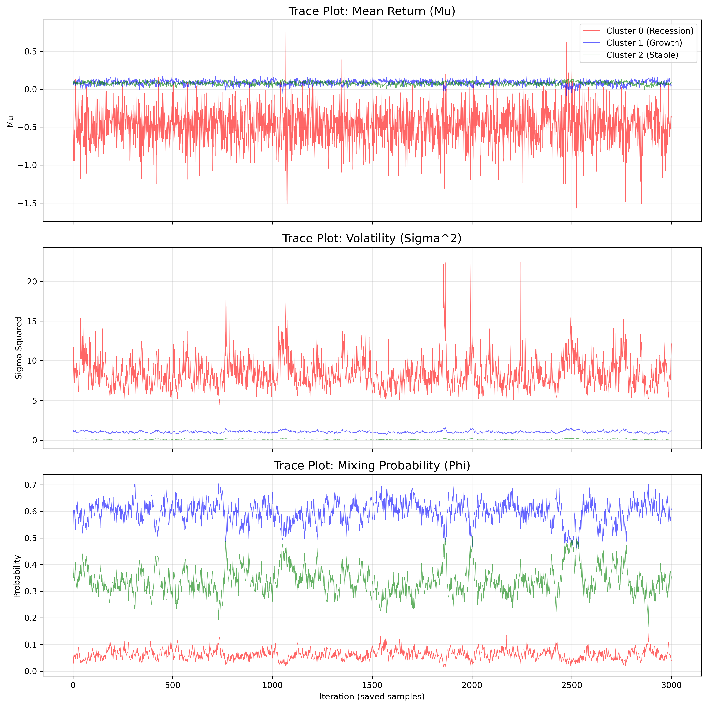
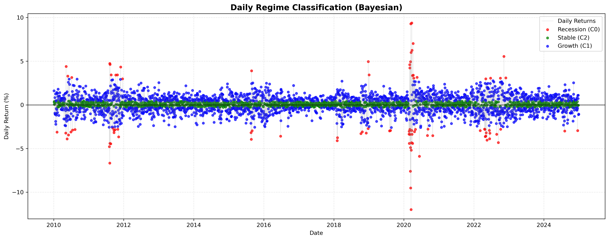

# Bayesian Analysis of S&P 500 Market Regimes using Finite Mixture Models

## Project Overview

This project implements a Gibbs sampling algorithm **from scratch** to estimate the parameters of a finite mixture of normal distributions. Applied to financial time-series data, the model successfully identifies latent unobserved market regimes (Recession, Stable, and Growth) without relying on pre-labeled data.

The purpose of this repository is to demonstrate a deep understanding of **Bayesian Data Analysis**, **Markov Chain Monte Carlo (MCMC) methods**, and **Python algorithmic implementation**.

## Key Features

* **Algorithm from Scratch**: Implemented a custom Gibbs sampler iterating over latent indicators, component means, variances, and mixing probabilities without using high-level probabilistic programming libraries.
* **Mathematical Rigor**: Fully derived conditional posterior distributions involving Normal, Inverse-Gamma, Categorical, and Dirichlet priors.
* **Handling Label Switching**: Robustly addressed the MCMC "label switching" problem by implementing a random permutation strategy with post-simulation sorting to ensure identifiable, unimodal posterior components.

## Data & Methodology

* **Dataset**: 3,773 daily observations of the S&P 500 index percentage returns spanning from December 2009 to 2024.
* **Model Configuration**: A 3-component Gaussian mixture model ($K=3$) using weakly informative priors to let the data drive the inference.
* **MCMC Simulation**: The chain was run for 20,000 iterations with a burn-in period of 5,000 and a thinning factor of 5 to reduce autocorrelation.

## Key Findings

The Bayesian model organically separated the market into three distinct economic regimes:

* **Cluster 0 (Recession)**: Captures extreme market distress (~6% of days) with negative average returns and extreme volatility. The time-varying posterior probability plot accurately flags historical crises like the 2020 COVID-19 crash and the 2011-2012 European Debt Crisis.
* **Cluster 2 (Stable)**: Represents calm, steady appreciation (~34% of days) with positive returns and the lowest volatility.
* **Cluster 1 (Growth)**: Captures aggressive bull markets (~60% of days) with the highest average returns and moderate volatility.

### MCMC Parameter Convergence (Tarce Plot)



### S&P 500 Market Regime Classification



## How to Run

```bash
# Clone the repository
git clone https://github.com/2002dangquan/Bayesian-Mixture-Model.git

# Install dependencies (e.g., NumPy, Pandas, Matplotlib, SciPy)
pip install -r requirements.txt

# Run the main analysis script
python main.py
```
